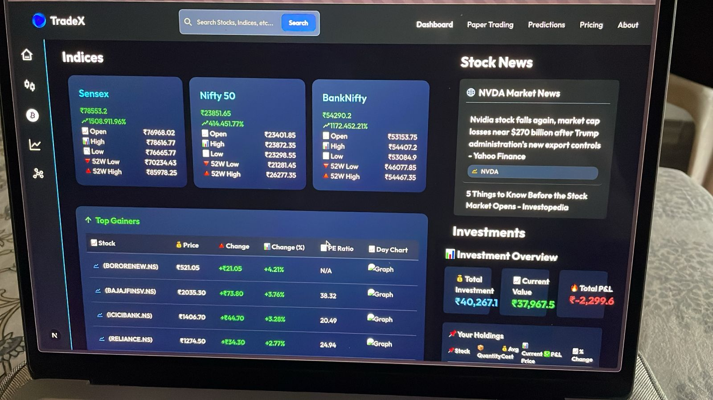
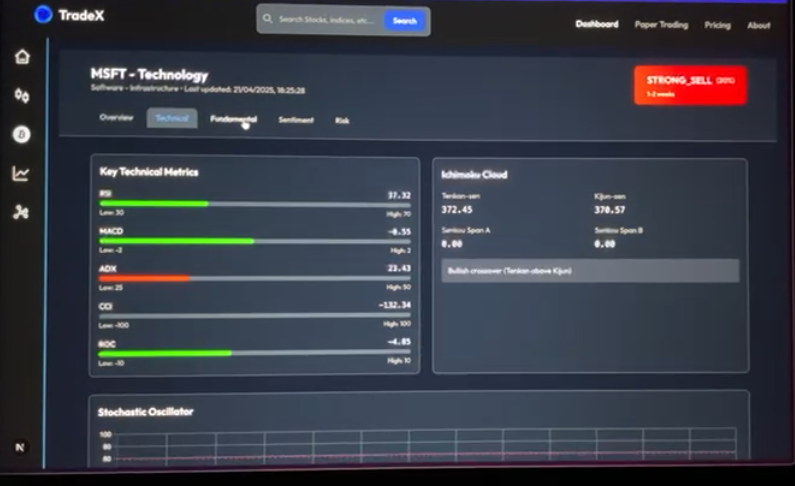
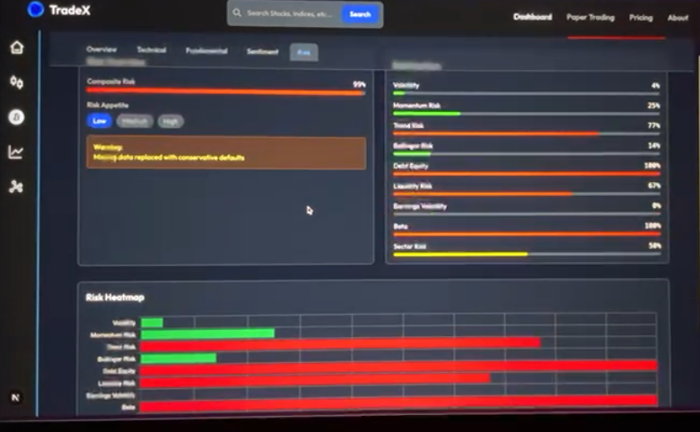

# FinTorr — AI Financial Intelligence Platform

> **Proprietary AI Venture · Launching Soon**

AI-driven financial market intelligence platform integrating fundamental analysis, technical indicators, sentiment intelligence, reinforcement learning trading logic, and paper trading simulation — built for retail investors and quantitative analysts who want AI-grade market insight.

---

## What It Does

FinTorr gives investors an AI co-pilot for market analysis. It doesn't just show charts — it reads earnings reports, processes sentiment signals, runs technical indicator intelligence, generates buy/sell signals through a reinforcement learning engine, and lets you test strategies through a paper trading simulation — all in one unified platform.

---

## Core Capabilities

- Fundamental market analysis (earnings, valuations, financials)
- Technical indicator intelligence (RSI, MACD, Bollinger, custom signals)
- Sentiment-driven analytics from news and social signals
- Reinforcement learning trading logic and signal generation
- AI-assisted financial report analysis
- Portfolio intelligence and risk evaluation
- Multi-market analytics
- Educational paper trading infrastructure with simulation
- Interactive real-time dashboard

---

## Architecture

```
Data Layer           →  Multi-source market data ingestion (real-time + historical)
Fundamental Layer    →  Earnings, valuation, and financial statement analysis
Technical Layer      →  Indicator computation and pattern recognition
Sentiment Layer      →  NLP-powered news and signal sentiment processing
RL Layer             →  Reinforcement learning buy/sell signal engine
Portfolio Layer      →  Risk evaluation and portfolio intelligence
Simulation Layer     →  Paper trading execution and performance tracking
Dashboard Layer      →  React.js interactive visualisation and UI
```

---

## Technology Stack

**AI / ML**
- PyTorch · TensorFlow · Reinforcement Learning
- NLP pipelines · Sentiment analysis · CNN-BiLSTM forecasting

**Frontend**
- React.js · Node.js · TailwindCSS · Recharts

**Backend**
- Python · FastAPI · Real-time data processing pipelines

**Data**
- Pandas · NumPy · Quantitative analytics infrastructure

---

## Platform Preview

### Dashboard


### Technical Analysis


### Risk Intelligence


---

## Proprietary Notice

> This repository documents the system architecture, platform design, and capability overview of FinTorr.
>
> Core ML systems, reinforcement learning pipelines, backend infrastructure, trading orchestration components, and deployment systems are **proprietary and not publicly released** as this platform is under active development for commercial launch.
>
> For partnership or investment inquiries: **ribhavsoni19@gmail.com**

---

## Founder

**Ribhav Soni** — ML Engineer · AI Researcher · Founder

- 9.8/10 GPA, Pune Institute of Computer Technology
- 4 international research publications
- Barclays Hackathon winner

[github.com/Ribhav19](https://github.com/Ribhav19) · ribhavsoni19@gmail.com
